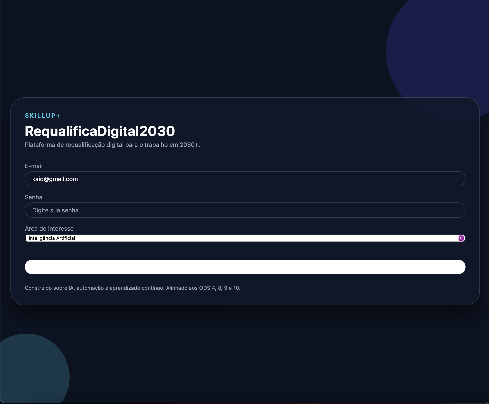
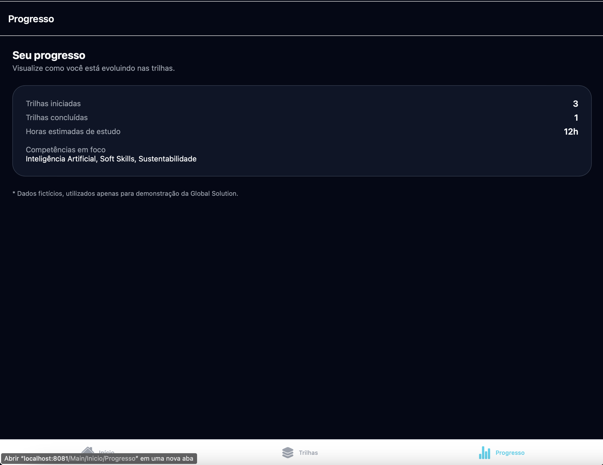
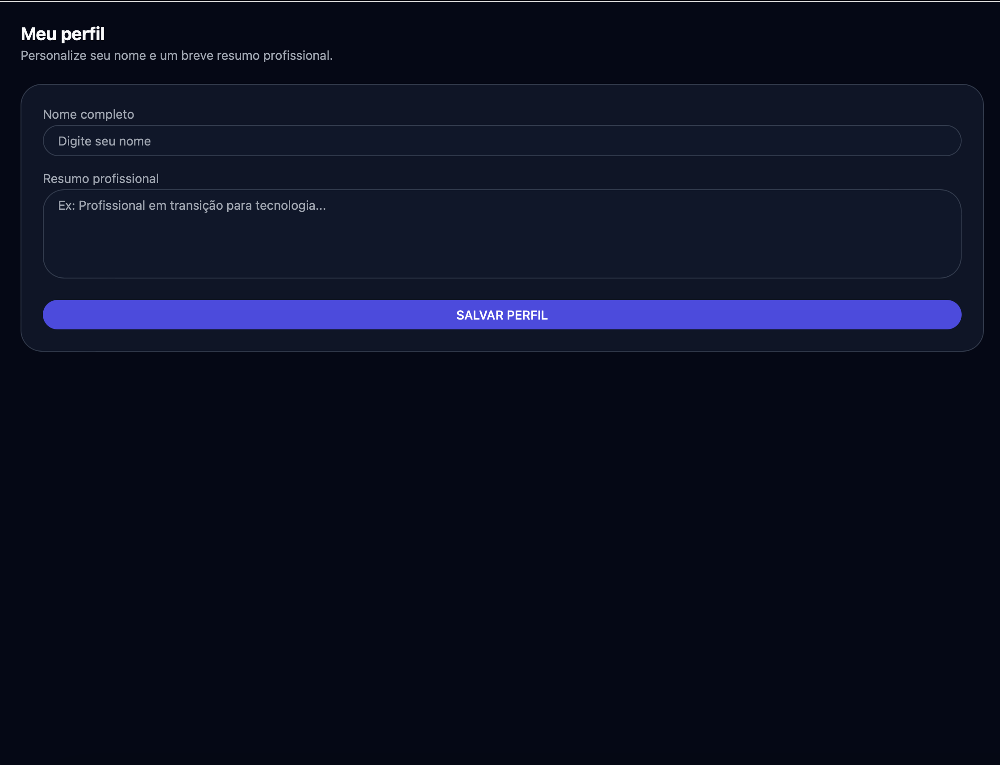
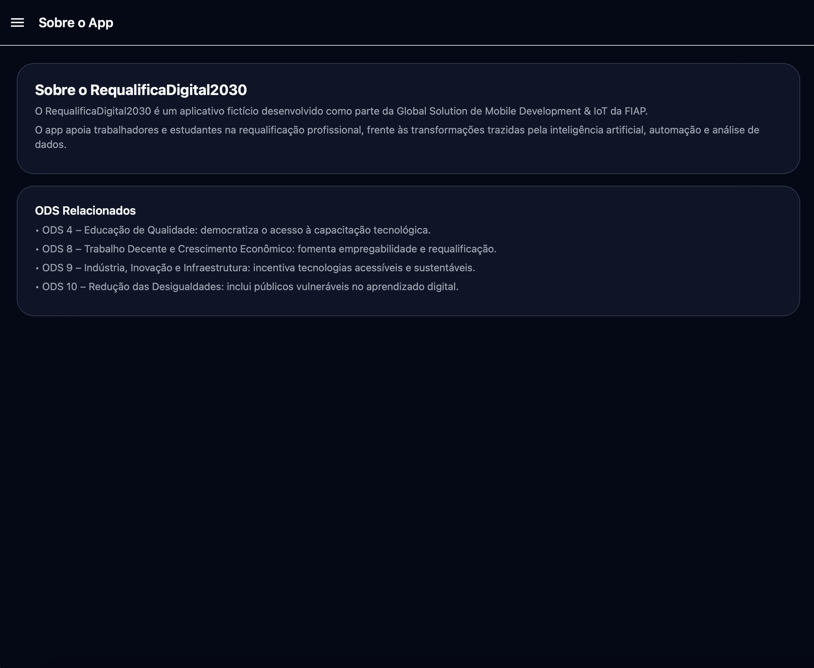
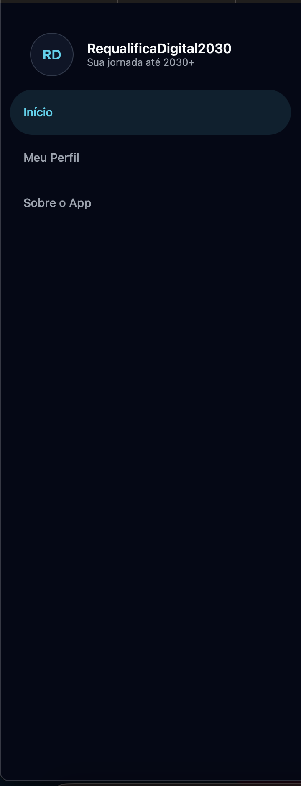

# 🚀 RequalificaDigital2030

> Plataforma de requalificação profissional para o trabalho em 2030+, alinhada aos ODS da ONU.

Aplicativo desenvolvido para a **Global Solution – Mobile Development & IoT (FIAP)**, com foco em apoiar estudantes e profissionais na jornada de **requalificação digital** frente ao impacto da inteligência artificial, automação e análise de dados.

---

## 🎯 Propósito do App

O RequalificaDigital2030 foi criado para:

- Apoiar a **requalificação profissional** para o futuro do trabalho;
- Facilitar o acesso a **trilhas de aprendizado** em áreas emergentes;
- Permitir que o usuário visualize **progresso** de forma clara;
- Conectar educação e tecnologia aos **ODS 4, 8, 9 e 10**.

---

## 🌍 Alinhamento aos ODS da ONU

O app está alinhado aos seguintes objetivos:

- **ODS 4 – Educação de Qualidade**
- **ODS 8 – Trabalho Decente e Crescimento Econômico**
- **ODS 9 – Indústria, Inovação e Infraestrutura**
- **ODS 10 – Redução das Desigualdades**

---

# 🧭 Arquitetura de Navegação (Híbrida)

A navegação segue o padrão solicitado na GS:

### 🔹 Stack Navigator  
- Login  
- Main (contém o Drawer)  
- CursoDetalhe  

### 🔹 Drawer Navigator  
- Início  
- Meu Perfil  
- Sobre o App  

### 🔹 Bottom Tabs  
- Home  
- Trilhas  
- Progresso  

---

# 📱 Telas da Aplicação  
> As imagens abaixo são carregadas automaticamente da pasta `/prints`.

---

## 🔐 **1. Tela de Login**


---

## 🏠 **2. Tela Inicial (Home)**


---

## 📚 **3. Trilhas de Aprendizado**


---

## 📘 **4. Detalhes da Trilha**


---

## 📊 **5. Progresso**


---

## 👤 **6. Meu Perfil**


---

## ℹ️ **7. Sobre o App**


---

## 📂 **8. Drawer Aberto (Menu Lateral)**  


---

## 🗂️ **9. Estrutura do Projeto (VS Code)**  


---

# 🧩 Componentes Utilizados

- `View`, `ScrollView`, `Text`
- `TextInput`, `Button`, `TouchableOpacity`, `Alert`
- `Picker` (área de interesse)
- `useState`, `useEffect`
- `AsyncStorage` para persistência
- `StackNavigation`, `DrawerNavigation`, `BottomTabNavigation`

---

# 💾 Persistência de Dados

Utilizamos `AsyncStorage` para armazenar:

- E-mail do usuário  
- Área de interesse  
- Nome no perfil  

Esses dados são carregados automaticamente quando o app é aberto novamente.

---

# 🛠 Tecnologias

- React Native com Expo  
- TypeScript  
- React Navigation  
- AsyncStorage  
- Expo Web  
- UI personalizada (NeoFuture Dark)

## 👥 Integrantes  
- **KAIO VINICIUS MEIRELES ALVES – RM553282**  
- **LUCAS ALVES DE SOUZA – RM553956**


---

# ▶️ Como Rodar

```bash
npm install
npx expo install @react-navigation/native @react-navigation/stack \
@react-navigation/bottom-tabs @react-navigation/drawer \
react-native-screens react-native-safe-area-context \
react-native-gesture-handler react-native-reanimated \
@react-native-async-storage/async-storage @react-native-picker/picker

npm run web   # para rodar no navegador
npx expo start  # para rodar no Expo Go
